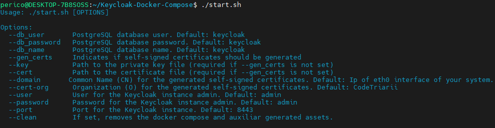

<div align="center">

<!-- PROJECT LOGO -->
# 📝 Keycloak Docker Compose


---

This project serves the purpose of setting up a `Keycloak` instance leveraging `docker compose` exposed over HTTPS leveraging self-signed certificates.

---

[Report Bug](https://github.com/paf-triarii/Keycloak-Docker-Compose/issues) · [Request Feature](https://github.com/paf-triarii/Keycloak-Docker-Compose/issues)
</div>

<!-- TABLE OF CONTENTS -->


## 📚 Table of contents

- [📝 Keycloak Docker Compose](#-keycloak-docker-compose)
  - [📚 Table of contents](#-table-of-contents)
  - [💡 Structure](#-structure)
  - [🚀 Installation and Execution](#-installation-and-execution)
    - [🔨 Prerequisites](#-prerequisites)
    - [🗜️ Getting Started](#️-getting-started)
  - [📍 Roadmap](#-roadmap)
  - [📎 Contributing](#-contributing)
  - [📃 License](#-license)
  - [👥 Contact](#-contact)
  - [🔍 Acknowledgments](#-acknowledgments)

<!--te-->

<!-- PROJECT DETAILS -->
## 💡 Structure


## 🚀 Installation and Execution

### 🔨 Prerequisites

- Docker CE installed (including compose plugin) - [How to install Docker CE](https://docs.docker.com/engine/install/)
- yq YAML processor installed.

```bash
sudo wget -qO /usr/local/bin/yq https://github.com/mikefarah/yq/releases/latest/download/yq_linux_amd64
sudo chmod a+x /usr/local/bin/yq
```

[🔝 Back to top](#-keycloak-docker-compose)

### 🗜️ Getting Started

To get started with this project, you need to run the `start.sh` script. This script accepts several options:

- `--db_user`: PostgreSQL database user. Default: keycloak
- `--db_password`: PostgreSQL database password. Default: keycloak
- `--db_name`: PostgreSQL database name. Default: keycloak
- `--gen_certs`: Indicates if self-signed certificates should be generated
- `--key`: Path to the private key file (required if --gen_certs is not set)
- `--cert`: Path to the certificate file (required if --gen_certs is not set)
- `--cert-cn`: Common Name (CN) for the generated self-signed certificates. Default: Ip of eth0 interface of your system
- `--cert-org`: Organization (O) for the generated self-signed certificates. Default: CodeTriarii
- `--user`: User for the Keycloak instance admin. Default: admin
- `--password`: Password for the Keycloak instance admin. Default: admin
- `--port`: Port for the Keycloak instance. Default: 8443
- `--ream`: [Optional] Points to a realm json file to set the import.
- `--clean`: If set, removes the docker compose and auxiliary generated assets.
- `--debug`: Enables debug verbosity.



Here's an example of how to run the script:

```bash
./start.sh --port 8443 --gen_certs
```

> \[!TIP\]
> If you want to enable more verbosity in logs, just pass the `--debug` argument!

<div align="center">


</div>

> \[!TIP\]
> If you want the port to be mapped with 443 (privileged port), launch the command with sudo!

> \[!TIP\]
> You can load a realm of your own by using the `--realm <path-to-file>.json` option.


[🔝 Back to top](#-keycloak-docker-compose)

<!-- GETTING STARTED -->

<!-- ROADMAP -->
## 📍 Roadmap

- [x] Automated start script.
- [x] Included automated clean-up.
- [x] Extended help for user friendly understanding.
- [x] Included multiple args for flexibility.
- [x] Prepared for HTTPS. Either with cert automated generation or inputting your own certs.

See the [open issues](https://github.com/paf-triarii/Keycloak-Docker-Compose/issues) for a full list of proposed features (and known issues).

[🔝 Back to top](#-keycloak-docker-compose)

<!-- CONTRIBUTING -->
## 📎 Contributing

Contributions are what make the open source community such an amazing place to learn, inspire, and create. Any contributions you make are **greatly appreciated** :chart:.

If you have a suggestion that would make this better, please fork the repo and create a pull request. You can also simply open an issue with the tag "enhancement".

1. Fork the Project
2. Create your Feature Branch

   ```sh
   git checkout -b feature/AmazingFeature
   ```

3. Commit your Changes

   ```sh
   git commit -m 'Add some AmazingFeature
   ```

4. Push to the Branch

   ```sh
   git push origin feature/AmazingFeature
   ```

5. Open a Pull Request

[🔝 Back to top](#-keycloak-docker-compose)

<!-- LICENSE -->
## 📃 License

Distributed under the [`APACHE 2.0`](./LICENSE) License.

[🔝 Back to top](#-keycloak-docker-compose)

<!-- CONTACT -->
## 👥 Contact

<div align="center">

---

**`PAF TRIARII (pedroarias1015@gmail.com) a member of Code Triarii`**

---

[](https://twitter.com/codetriariism)
[](https://www.tiktok.com/@codetriariism)
[](https://medium.com/@codetriariism)
[](https://www.youtube.com/@CodeTriariiSM)
[](https://www.instagram.com/codetriariismig/)

</div>

As we always state, our main purpose is keep learning, contributing to the community and finding ways to collaborate in interesting initiatives.
Do not hesitate to contact us at `codetriariism@gmail.com`

If you are interested in our content creation, also check our social media accounts. We have all sorts of training resources, blogs, hackathons, write-ups and more!
Do not skip it, you will like it :smirk: :smirk: :smirk: :+1:

Don't forget to give the project a star if you liked it! Thanks again! :star2: :yellow_heart:

[🔝 Back to top](#-keycloak-docker-compose)

<!-- ACKNOWLEDGMENTS -->
## 🔍 Acknowledgments

:100: :100: :100: For those that are curious about some of the resources or utilities and for sure thanking and giving credit to authors, we provide you a list of the most interesting ones (in our understanding) :100: :100: :100:

- [eabykov Keycloak Compose](https://github.com/eabykov/keycloak-compose/tree/main) - Thank you for the reference. The star is given 😉
- [Keycloak in a container - Official Documentation](https://www.keycloak.org/server/containers)

[🔝 Back to top](#-keycloak-docker-compose)